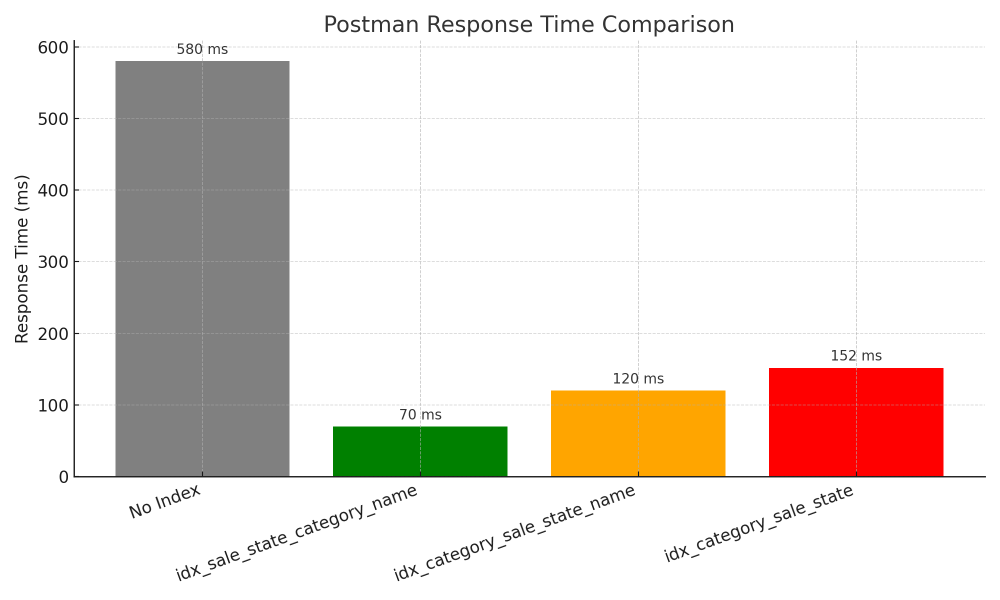
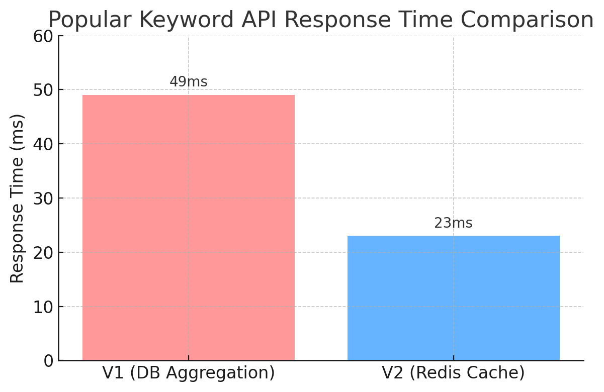
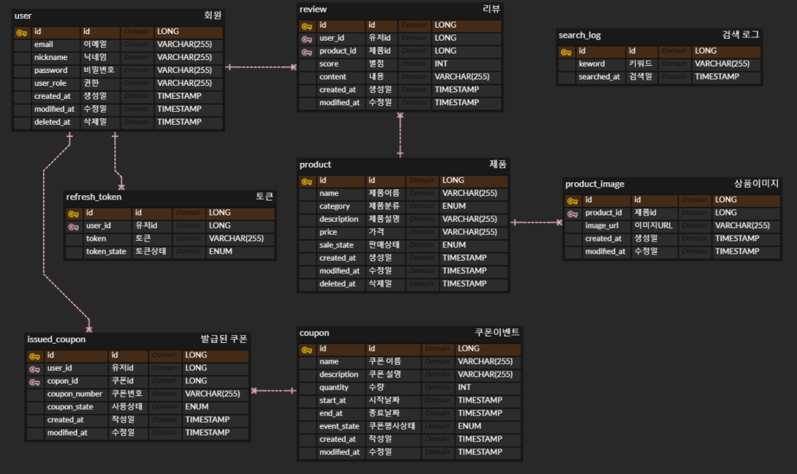

# 💄 플러스 프로젝트 - 화장품 조회 및 쿠폰 발급 애플리케이션


[](https://github.com/team8-nbc/team8-project)

## Eighty-age (8자주름)
> **Eighty-age**는 실시간 검색과 쿠폰 기능을 갖춘  
> **화장품 이커머스 웹 서비스**입니다.  
> Redis 기반 캐싱과 동시성 제어를 적용했습니다.

---

## 🎯 프로젝트 핵심 목표
1. **성능 최적화**
    - Redis 기반 캐싱 및 인덱스 튜닝을 통해 실시간 상품 조회 및 인기 검색어 응답 속도 개선

2. **동시성 제어**
    - Redisson 기반 분산 락으로 쿠폰 발급 시 중복 방지 및 트랜잭션 안정성 확보

3. **운영 및 배포 효율화**
    - GitHub Actions와 Docker를 활용한 CI/CD 구축
    - AWS 인프라(ECR, EC2, RDS, S3, ElastiCache) 기반의 자동화 배포 환경 구성

---

## 💡 주요 기능

| 도메인 | 기능 | 설명                                |
|--------|------|-----------------------------------|
| 👤 회원 | 회원가입 | 사용자(User/Admin) 구분 등록, 비밀번호 정책 적용 |
| 👤 회원 | 로그인 | JWT 발급 및 인증 처리                    |
| 👤 회원 | 회원정보 수정 | 비밀번호 확인 후 닉네임 등 정보 수정             |
| 👤 회원 | 회원탈퇴 | 비밀번호 재확인 후 Soft Delete 처리         |
| 🖼 이미지 | 이미지 업로드 | S3에 저장 후 URL 반환                   |
| 🧴 제품 | 제품 생성 | 관리자 권한으로 제품 등록                    |
| 🧴 제품 | 제품 수정 / 삭제 | 제품 정보 및 이미지 수정/삭제                 |
| 🧴 제품 | 제품 단건 조회 | ID 기반 상세 정보 조회                    |
| 🧴 제품 | 제품 리스트 조회 | 전체 또는 필터 조건에 따른 리스트 반환            |
| 🧴 제품 | 제품 이미지 추가/삭제 | 제품에 다중 이미지 추가 및 삭제 기능             |
| 🔍 검색 | 제품 검색 | 키워드, 카테고리, 정렬 조건 기반 검색            |
| 🔍 검색 | 인기 검색어 | 일정 기간 내 가장 많이 검색된 키워드 Top-N 제공    |
| 🔍 검색 | 급상승 검색어 | 최근 검색량 급증한 키워드 자동 집계              |
| 📝 리뷰 | 리뷰 작성 | 구매한 유저에 한해 평점 및 코멘트 등록            |
| 📝 리뷰 | 리뷰 수정 / 삭제 | 본인이 작성한 리뷰 수정 및 삭제 가능             |
| 📝 리뷰 | 제품별 리뷰 조회 | 제품 상세 페이지 내 리뷰 리스트 제공             |
| 🎟 쿠폰 | 쿠폰 생성 / 수정 | 관리자만 등록 가능, 수량 및 유효기간 포함          |
| 🎟 쿠폰 | 쿠폰 조회 | 전체 쿠폰 또는 상태별 필터링 지원               |
| 🎟 쿠폰 | 쿠폰 단건 조회 | 사용 가능한 쿠폰 단건 정보 반환                |
| 🎟 쿠폰 | 쿠폰 담기 | 사용자 요청 시 사용 조건 만족하면 발급            |

## 🛠️ 기술 스택

### **언어 및 프레임워크**
- Java 17
- Spring Boot 3.4.4

### **데이터베이스**
- MySQL
- H2

### **캐시 서버**
- Redis (ElastiCache)

### **인증 및 보안**
- JWT
- Bcrypt
- Spring Security

### **기타**
- JPA
- JUnit 5
- GitHub Actions
- Docker
- AWS (EC2, S3, RDS, ElastiCache, ECR)

---

## 🔥 Key Summary

### Redisson 기반 분산 락 적용으로 안정적인 쿠폰 발급 처리

- 동시성 제어가 필요한 쿠폰 발급 기능에 Redisson 기반 분산 락 도입
- 단일 서버 환경을 고려해 Redisson Single Server Mode 사용

### 인기 검색어 캐싱: DB 집계 방식 대비 응답 속도 10배 이상 향상

- 기존 방식은 검색 로그를 실시간 집계 → 응답 지연 발생
- Redis Sorted Set으로 전환하여 **25ms 내 인기 검색어 조회 가능**
- DB 접근 없이 실시간 순위 조회에 적합한 구조로 개선
    <details>
    <summary><strong>🔍 검색 API에 캐시를 적용한 이유</strong></summary>
    
    여러 사용자가 키워드를 입력하여 제품을 검색하면, 해당 검색어는 SearchLog 테이블에 저장된다.  
    이 데이터를 기반으로 사용자는 인기 검색어 목록을 조회할 수 있다.
    
    그러나 다수의 사용자가 동시에 인기 검색어를 요청할 경우,  
    SearchLog 테이블에서 실시간으로 데이터를 집계하게 되며 DB에 과부하가 발생한다.  
    이는 전체 시스템 성능 저하로 이어질 수 있다.
    
    이러한 문제를 해결하기 위해 캐시를 적용하여,  
    DB 접근 없이 인기 검색어를 빠르게 조회할 수 있도록 설계하였다.
    </details>

### 인덱스 튜닝으로 실시간 상품 조회 성능 8.3배 개선

- 복합 조건 검색 쿼리에 대해 인덱스 최적화 적용 → `idx_sale_state_category_name` 인덱스 사용
- Postman 기준 **580ms → 70ms (약 8.3배 성능 향상)**
- 쿼리 실행 계획 기반으로 다양한 인덱스를 실험하고 가장 효율적인 조합을 도출

### N+1 문제 해결로 다중 쿼리 제거

- `Review` 조회 시 연관된 `User`, `Product`로 인해 N+1 발생
- `JOIN FETCH` 적용하여 필요한 데이터 한 번에 로딩, 성능 개선

### GitHub Actions 기반 CI/CD 구축

- PR 생성 시 자동 빌드 & 테스트, main 브랜치 푸시 시 자동 배포
- Slack 알림 연동으로 PR, Merge, 배포 성공/실패 상황 실시간 공유
- AWS ECR을 통한 Docker 이미지 관리 및 EC2 배포
- ElastiCache(Redis)를 이용한 인기 검색어 및 쿠폰 캐싱 처리

## 💡기술적 고도화

<details>
<summary><strong>인덱스 적용으로 응답속도 8.29배 개선</strong></summary>

### 인덱스를 활용한 쿼리 최적화

---
#### 최적화 대상 쿼리 선정 기준
어떤 조건으로 쿼리문을 작성하느냐에 따라 DB 응답속도가 달라지고, 최적화를 적용할 수 있는지 판단할 수 있다.

- 기본키, 외래키, 유니크 컬럼은 이미 정렬되어 있어 인덱스 효과가 크지 않음
- 반면, **복합 조건**을 가지는 **검색 쿼리**는 성능 최적화 효과가 큼

#### 선택한 검색 쿼리
```
@Query("SELECT new com.example.eightyage.domain.product.dto.response.ProductSearchResponseDto(p.name, p.category, p.price, AVG(r.score)) " +
      "FROM Product p LEFT JOIN p.reviews r " +
      "WHERE p.saleState = 'FOR_SALE' " +
      "AND (:category IS NULL OR p.category = :category) " +
      "AND (:name IS NULL OR p.name LIKE CONCAT('%', :name, '%')) " +
      "GROUP BY p.name, p.category, p.price " +
      "ORDER BY AVG(r.score)")
```
위 쿼리에 쿼리문 최적화 방법중 인덱스를 사용하여 쿼리 최적화 결정

### 인덱스 적용과 성능 비교
여러 인덱스 후보를 선택하여 인덱스 적용 전과 성능 및 실행계획 비교

| Index Strategy                  | Response Time (ms) | Actual DB Time | Rows Scanned | Cost     |
|---------------------------------|--------------------|----------------|--------------|----------|
| No Index                        | 580                | -              | 1,019,721    | -        |
| idx_sale_state_category_name    | 70 (8.3x faster)   | 39.2ms         | 145,046      | 1.36e+6  |
| idx_category_sale_state_name    | 120 (4.8x faster)  | 51.6ms         | 145,846      | 1.36e+6  |
| idx_category_sale_state         | 152 (3.8x faster)  | 122ms          | **109,560**  | **619,582** |

- `idx_sale_state_category_name` 인덱스 적용시 응답속도 및 실제 DB 실행시간이 가장 빠르다.
- **postman 응답속도**: 580ms → 70ms (8.29배 개선)

### 그래프


### 향후 계획
- 검색 성능을 높이기 위해 전문인덱스나 `Elastic Search` 및 더 정확한 검색엔진 사용

</details>

<details>
<summary><strong>Redis 캐시로 인기 검색어 조회 응답 속도 2.13배 개선</strong></summary>

### 성능 비교: DB 집계 방식 vs Redis 캐시 방식
| 버전 | 방식            | 응답 속도 (ms) | 개선률         |
|------|-----------------|----------------|----------------|
| V1   | DB 실시간 집계   | 49 ms          | 기준값         |
| V2   | Redis Sorted Set | 23 ms          | 🔥 약 **2.13배 개선** |

### 그래프


- V1은 검색 로그 테이블에서 실시간으로 집계하여 응답 → 49ms 소요
- V2는 인기 검색어를 Redis Sorted Set에 캐싱하여 조회 → 23ms 소요
- DB 접근 없이 빠르게 인기 키워드를 조회할 수 있어 서버 부하를 줄이고 사용자 경험 향상

</details>

<details>
<summary><strong>N+1 문제 해결: JOIN FETCH로 성능 개선</strong></summary>

### 문제 요약
상품 삭제 시 관련 리뷰들을 soft delete 처리하는 과정에서  
`Review → User`, `Review → Product` 지연로딩으로 인해 **N+1 문제가 발생**했다.

### 문제 코드
```
// ProductService.java - deleteProduct 메소드
Product findProduct = productRepository.findProductByIdOrElseThrow(productId);
List<Review> findReviewList = reviewRepository.findReviewsByProductId(productId);

for (Review review : findReviewList){
    review.setDeletedAt(LocalDateTime.now());
}

// ProductRepository.java
@Query("SELECT r FROM Review r WHERE r.product.id = :productId AND r.deletedAt IS NULL")
List<Review> findReviewsByProductId(@Param("productId") Long productId);
```
- `Review`와 연관된 `User`, `Product`가 지연로딩(LAZY) 되어 조회 시마다 추가 쿼리가 발생 → N+1

### 가설
- `findReviewList`가 N개라면, 각각의 `Review`마다 `User`, `Product` 조회 쿼리 1회씩 추가 실행됨
- 총 1 + (2 × N) 개의 쿼리 발생 → 심각한 성능 저하

### 해결 방안
- `JOIN FETCH` vs. `@EntityGraph`를 비교하여 성능 우위인 `JOIN FETCH` 선택
- `JOIN FETCH`의 경우 추가적인 SELECT 없이 1번의 즉시 조인으로 데이터를 가져올 수 있어 `@EntityGraph` 보다 성능이 좋다고 판단
- 
### 해결 완료
```
@Query("SELECT r FROM Review r JOIN FETCH r.user JOIN FETCH r.product WHERE r.product.id = :productId AND r.deletedAt IS NULL")
List<Review> findReviewsByProductId(@Param("productId") Long productId);
```
- `JOIN FETCH` 로 필요한 데이터를 한번에 가져와서 해결했다.

</details>

---

## ⚠️ 트러블 슈팅 모음

- [🛠️ GitHub Actions 기반 CD 실전 트러블슈팅: EC2, ECR, ElastiCache](https://velog.io/@3uomlkh/GitHub-Actions-%EA%B8%B0%EB%B0%98-CD-%EC%8B%A4%EC%A0%84-%ED%8A%B8%EB%9F%AC%EB%B8%94%EC%8A%88%ED%8C%85)
- [쿠폰 발급 시스템에서의 분산락 사용](https://velog.io/@siha_014/%EC%BF%A0%ED%8F%B0-%EB%B0%9C%EA%B8%89-%EC%8B%9C%EC%8A%A4%ED%85%9C%EC%97%90%EC%84%9C%EC%9D%98-%EB%B6%84%EC%82%B0%EB%9D%BD-%EC%82%AC%EC%9A%A9)
- [인덱스를 이용하여 쿼리를 최적화 하기](https://queenriwon3.tistory.com/145)
- [트러블 슈팅: N + 1 문제](https://velog.io/@cock321/%ED%94%84%EB%A1%9C%EC%A0%9D%ED%8A%B8-%ED%94%8C%EB%9F%AC%EC%8A%A4-%ED%94%84%EB%A1%9C%EC%A0%9D%ED%8A%B8-%ED%8A%B8%EB%9F%AC%EB%B8%94-%EC%8A%88%ED%8C%85-N-1-%EB%AC%B8%EC%A0%9C)
- [트러블 슈팅: 테스트](https://velog.io/@cock321/%ED%94%84%EB%A1%9C%EC%A0%9D%ED%8A%B8-%ED%94%8C%EB%9F%AC%EC%8A%A4-%ED%94%84%EB%A1%9C%EC%A0%9D%ED%8A%B8-%ED%8A%B8%EB%9F%AC%EB%B8%94-%EC%8A%88%ED%8C%85-%ED%85%8C%EC%8A%A4%ED%8A%B8)
- [인기 검색어 구현 Redis 설정 및 문제 해결하기](https://dev-leonie.tistory.com/76)
---

## ⚙️ 인프라 아키텍처 & 적용 기술

### 아키텍처 다이어그램


본 아키텍처는 **Spring Boot 기반의 단일 애플리케이션 구조**로,  
**Docker 컨테이너화**, **GitHub Actions 기반 CI/CD**,  
그리고 **AWS EC2 / RDS / S3 / ElastiCache**를 연동하여  
**자동화된 배포와 안정적인 서비스를 제공**합니다.

<details>
<summary><b>📦 적용 기술 상세보기</b></summary>

### 데이터베이스 & 캐시
- **MySQL (RDS)**  
  → 사용자, 제품, 리뷰, 쿠폰 등의 주요 데이터 저장

- **Redis (ElastiCache)**  
  → 인기 검색어, 최저가 캐싱에 사용. TTL 기반 만료 처리로 효율적 데이터 유지

### 클라우드 & 저장소
- **AWS S3**  
  → 제품/프로필 이미지 업로드 및 정적 리소스 저장

- **AWS EC2**  
  → 애플리케이션 서버 호스팅

- **AWS RDS / ElastiCache / ECR**  
  → 각각 DB, 캐시, 도커 이미지 저장소 역할

### 배포 & 자동화
- **Docker**  
  → 각 모듈/애플리케이션 컨테이너화

- **GitHub Actions**  
  → CI/CD 파이프라인 구축, Slack 연동 알림 포함  
  → main 브랜치 푸시 및 PR Merge 시 자동 배포 트리거

</details>

---

## 🧬 ERD


---

## 📜 API 명세서
[API 명세서 보기](https://www.notion.so/teamsparta/1c02dc3ef51480bfb6c9cbfee2f21988?v=1c02dc3ef5148122b18a000cfaac78cd&pvs=4)

---

## 🖼️ 와이어프레임
[와이어 프레임 보기](https://docs.google.com/presentation/d/1CGiVB2tNL9U6rh07Q-bPvRVIIe93rWLhxVO4y5L18kI/edit?slide=id.g342ec0032c7_7_0#slide=id.g342ec0032c7_7_0)

---

## ❤️ 팀원 소개
<table align="center">
  <tr>
    <td align="center" style="padding: 10px;">
      <br />
      <sub>👑 팀장</sub><br />
      <b>이채원</b><br />
      CI/CD<br />
      <a href="https://github.com/3uomlkh">GitHub</a>
    </td>
    <td align="center" style="padding: 10px;">
      <br />
      <sub>✨ 팀원</sub><br />
      <b>봉수현</b><br />
      쿠폰 <br />
      <a href="https://github.com/SuhyeonB">GitHub</a>
    </td>
    <td align="center" style="padding: 10px;">
      <br />
      <sub>✨ 팀원</sub><br />
      <b>이지은A</b><br />
      인증 / 인가<br />
      <a href="https://github.com/queenriwon">GitHub</a>
    </td>
    <td align="center" style="padding: 10px;">
      <br />
      <sub>✨ 팀원</sub><br />
      <b>이지은B</b><br />
      제품 / 리뷰<br />
      <a href="https://github.com/ijieun0123">GitHub</a>
    </td>
    <td align="center" style="padding: 10px;">
      <br />
      <sub>✨ 팀원</sub><br />
      <b>전서연</b><br />
      인기 검색어<br />
      <a href="https://github.com/MythologyDevSeoyeon">GitHub</a>
    </td>
  </tr>
</table>


